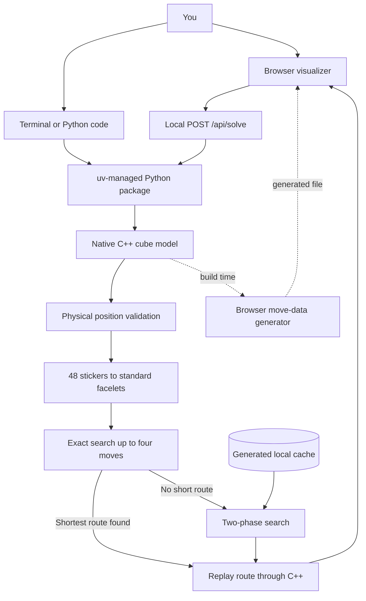

# Rubikoslav

Turn the cube, press Play, and watch the engine solve the exact position you made.

Rubikoslav is a local 3×3 Rubik's Cube solver with a C++ cube model, a Python solver, and an interactive browser view. It shows the solution one move at a time and verifies every route against the native cube model.

## Contents

- [Start here](#start-here)
- [Tour](#tour)
- [How solving works](#what-happens-when-you-press-play)
- [System architecture](#system-architecture)
- [Python example](#python-example)
- [Development guide](#development-guide)
- [Deployment](#deploy-the-complete-app)
- [Troubleshooting](#troubleshooting)

The solver proves the shortest answer for positions up to four turns from solved. Harder positions use the fast two-phase search, which aims for a short answer without claiming that every deep result is the mathematical optimum. The default limit is 22 moves.

During the native build, `WebDataGeneratorovich` applies every move to labeled stickers using the real C++ `Cuboslav`. It writes the resulting permutations to `web/generated/cube-data.js`. The browser uses those generated permutations.

CTest compares the committed browser data with freshly generated data. If somebody changes a native turn but forgets to refresh the browser file, the test fails instead of allowing the two views to drift apart.

## Start here

Install [uv](https://docs.astral.sh/uv/getting-started/installation/), then run:

```bash
uv run rubikoslav
```

That one command does the setup work:

1. uv creates the right Python environment.
2. It installs the pinned dependencies.
3. It compiles the small C++ extension.
4. It starts the local app at <http://127.0.0.1:4173>.
5. It opens the visualizer in your browser.

To start the server without opening a browser:

```bash
uv run rubikoslav --no-open
```

## Tour

Imagine you want to study the position produced by `R U F2`.

1. Press `R`, `U`, and `F2` in **Make a position**. The **Your moves** feed records each turn immediately.
2. Press **Solve & play**.
3. The app saves that exact position in memory, finds and checks a solution, then replaces **Your moves** with the verified **Solution** route.
4. Use the playback buttons directly below that route, or select a numbered solution token to revisit any move.

That is the main workflow. The raw 48-sticker array stays out of the way because the app can manage it by itself.

**Load route**, beside Scramble, opens a small prompt for a route such as `R U R' U'`. Use it to teach, test, or replay a particular algorithm. Standard face notation takes priority; compact `A`–`R` engine codes are accepted where they do not conflict with a face letter.

## Commands

| Command | What it does |
| --- | --- |
| `uv run rubikoslav` | Builds what is needed and opens the visualizer. |
| `uv run rubikoslav --no-open` | Starts the app without opening a browser. |
| `uv run rubikoslav --port 8080` | Uses a different local port. |
| `uv run rubikoslav solve "R U R' U'"` | Solves a scramble directly in the terminal. |
| `uv run rubikoslav doctor` | Checks the native module, solver connection, and web files. |
| `uv run rubikoslav doctor --strict` | Performs a real solve and replays the answer through C++. |
| `uv run rubikoslav --version` | Prints the installed version. |

Run `uv run rubikoslav --help` for the complete command reference.

## What happens when you press Play

Suppose you press a few face buttons and create a messy position.

### 1. The browser remembers the position

The browser keeps the 48 movable stickers in memory. When you press Play, it takes a copy of that state before doing anything else.

This is like taking a photograph before rearranging a desk. The solver works from the photograph, so the position cannot quietly change underneath it.

### 2. C++ checks whether the position can exist

Having eight stickers of every color is not enough to make a legal cube. You could peel off one corner sticker and rotate it, producing a position that looks plausible but can never be reached with normal turns.

The native cube model checks:

- whether all pieces exist exactly once;
- whether corners have a possible total twist;
- whether edges have a possible total flip;
- whether the corner and edge swaps agree with each other.

Impossible positions are rejected before the search begins.

### 3. Python translates the cube into a common layout

The C++ engine stores 48 movable stickers. Most two-phase solvers expect 54 facelets in `URFDLB` order: Up, Right, Front, Down, Left, Back.

The Python adapter converts between those layouts and inserts the six fixed centers. Think of it as translating the same address between two map formats. Nothing about the cube changes; only the way its location is written down changes.

### 4. Easy positions take the shortest route

Before doing the heavier search, Rubikoslav checks routes in order: one move, then two, then three, then four. It stops at the first solution. That makes the result provably shortest inside this range. If you turn `U` once, the answer is simply `U'`.

This small exact search also avoids paying the table-generation cost for positions that are already close to solved.

### 5. Harder positions use two phases

A direct search through every possible turn would grow far too quickly. The solver therefore divides the problem:

1. **Organize the cube.** Fix piece orientation and place the middle-slice edge set into a restricted, easier-to-handle family of positions.
2. **Finish the cube.** Permute the remaining pieces until every face is solved.

An everyday analogy is tidying a crowded room. First, put books with books and clothes with clothes. Once everything belongs to the right category, putting each item in its final place becomes much easier.

The first real solve may take several seconds because compact move and pruning tables are generated locally. They are cached under `~/.cache/rubik_solver/`, so later runs load them instead of rebuilding them.

Those tables store the distance from common partial positions, saving repeated work on later solves.

### 6. C++ checks the answer

The solver's route is not trusted merely because it came back without an error.

Every returned move is replayed through the native C++ cube. The route is accepted only if that replay reaches the solved state. It is the programming equivalent of checking your arithmetic by substituting the answer back into the original equation.

### 7. The browser animates the verified route

Only after validation, search, and replay does the server return normal move notation to the browser. The visualizer builds the timeline and begins playback.

## System architecture



- The runtime path begins when you ask for a solution. It goes from the browser or terminal to validation, search, native replay, and finally back to the result.
- The build-time path teaches the browser how each face turn moves stickers. It runs only when the native turn logic needs to be reflected in the web files.

### The parts in plain language

| Part | Its job | A useful way to think about it |
| --- | --- | --- |
| `Cuboslav` | Stores the cube, applies moves, and decides whether a state is physically possible. | The physical cube on the desk. |
| `Move` | Reads and writes notation such as `R`, `U2`, and `F'`. | The shared vocabulary. |
| `CuboslavWrapper` | Lets Python ask the C++ cube to move, validate, and replay. | A translator between two colleagues. |
| `Rubikoslav` | Coordinates translation, exact nearby search, two-phase fallback, timing, and verification. | The control desk for the whole solve. |
| `rubikoslav` | Starts the app, solves terminal scrambles, and runs health checks. | The front door. |
| `web/` | Shows the cube and lets you build or replay positions. | The classroom demonstration. |
| `WebDataGeneratorovich` | Derives browser turns from C++. | The source of the browser's movement instructions. |

## Cube representation

A physical 3×3 cube has 54 visible stickers, but its six center stickers never move relative to one another. The engine therefore stores only the 48 movable stickers and adds the centers when a standard 54-facelet representation is required.

The values mean:

| Value | Color | Solved face |
| ---: | --- | --- |
| `0` | White | Up |
| `1` | Red | Left |
| `2` | Blue | Front |
| `3` | Green | Back |
| `4` | Orange | Right |
| `5` | Yellow | Down |

The solved array is grouped as:

```text
white × 8, red × 8, blue × 8, yellow × 8, orange × 8, green × 8
```

External state arrays must contain exactly 48 integers from `0` to `5`, with every color appearing eight times. The native validator then performs the deeper piece and parity checks described above.

Most users never need to handle this array directly. It matters when embedding the engine or calling the Python API.

## Move notation

The public API follows familiar cube notation:

- `R` means one quarter turn of the right face.
- `R2` means a half turn.
- `R'` means a reverse quarter turn.

For example:

```text
R U R' U'
```

The engine also has a compact one-character format:

| Face | Compact codes |
| --- | --- |
| Up / white | `A`, `B`, `C` |
| Left / red | `D`, `E`, `F` |
| Front / blue | `G`, `H`, `I` |
| Back / green | `J`, `K`, `L` |
| Right / orange | `M`, `N`, `O` |
| Down / yellow | `P`, `Q`, `R` |

Each row represents the normal, half, and reverse turns in that order. The browser's **Load route** prompt, `move_code()`, and `solve_codes()` understand this compact format.

## Python example

Use the uv-managed interpreter so Python and the compiled extension always agree:

```bash
uv run python
```

Create a position with the native cube:

```python
from rubikoslav import CuboslavWrapper

cube = CuboslavWrapper()
cube.move("R")
cube.move("U2")
state = cube.getCube()
```

Now solve that exact state:

```python
from rubikoslav import Rubikoslav

solver = Rubikoslav()
result = solver.solve(state, max_depth=22)

if result.success:
    print(result.moves)
    print(f"{result.search_depth} moves")
    print(f"{result.elapsed_microseconds / 1_000:.1f} ms")
else:
    print(result.error)
```

`result.moves` uses standard notation. `solver.solve_codes(state)` returns compact one-character codes.

## Local web connection

`uv run rubikoslav` serves the visual files and a small local endpoint:

```text
POST /api/solve
```

The browser sends the current state and a maximum depth. The server returns the native-verified route, elapsed time, and any structured error. Searches are serialized so several browser requests cannot multiply CPU use unexpectedly.

For styling or layout work, you can serve only the static files:

```bash
python3 -m http.server 4173 --directory web
```

The cube and typed routes work in that mode, but solving does not. There is no `/api/solve` endpoint unless the app is started through `uv run rubikoslav`.

## Generated solver data

No manual download is required. On the first non-trivial solve, the two-phase backend generates its compact tables and stores them locally.

To see that first-run work:

```bash
uv run rubikoslav solve "R U R' U'" --verbose
```

To put the cache somewhere else:

```bash
export RUBIK_SOLVER_CACHE_DIR=/absolute/path/to/cache
uv run rubikoslav doctor --strict
```

The cache is deterministic: the same code builds the same tables. Deleting it costs initialization time, not correctness.

## Development guide

### Requirements

- uv;
- a C++20 compiler;
- the normal platform development tools needed to compile a Python extension.

Python is pinned through `.python-version`. Packaging tools are pinned in `pyproject.toml`, and the complete environment is recorded in `uv.lock`.

### Set up the project

```bash
uv sync --locked
```

### Run the Python tests

```bash
uv run python -m unittest discover -s python/tests -v
```

These tests cover state translation, native move equivalence, route replay, solver failures, CLI behavior, and the packaged visualizer contract.

### Run the native tests

```bash
cmake -S . -B build/native \
  -DRUBIKOSLAV_BUILD_PYTHON=OFF \
  -DRUBIKOSLAV_WARNINGS_AS_ERRORS=ON
cmake --build build/native --parallel
ctest --test-dir build/native --output-on-failure
```

The native tests cover moves, notation, simplification, long legal scrambles, and impossible cube states.

### Refresh browser move data

Do this after changing a C++ face-turn implementation:

```bash
cmake -S . -B build/native -DRUBIKOSLAV_BUILD_PYTHON=OFF
cmake --build build/native --target generate-web-data
ctest --test-dir build/native --output-on-failure
```

The `WebDataGeneratorovichIsCurrent` test fails if `web/generated/cube-data.js` no longer matches C++.

### Build release files

```bash
uv build
```

This creates a source archive and a platform wheel containing:

- the Python API and `rubikoslav` command;
- the compiled C++ cube module;
- the complete browser visualizer;
- the local solve endpoint;
- the GPL-3.0 license.

### Deploy the complete app

The Vercel deployment serves both the visualizer and the real Python/C++ solve endpoint. It is not a static mock.

```bash
vercel --prod
```

Vercel uses Python 3.12 from `.python-version`, installs the locked uv environment, compiles the native extension on Linux, and runs `api/solve.py`. The first request on a new function instance may be slower while the two-phase tables are generated under `/tmp`.

Pushes to `main` also deploy automatically through `.github/workflows/deploy.yml`. The workflow runs the Python tests and strict native-replay check before it builds and deploys the production output. Add one repository Actions secret named `VERCEL_TOKEN`; the non-secret Vercel organization and project IDs are already recorded in the workflow.

### Use only the native C++ library

Projects that need cube movement and validation, but not the Python solver, can install the native library:

```bash
cmake -S . -B build/native -DRUBIKOSLAV_BUILD_PYTHON=OFF
cmake --build build/native --parallel
cmake --install build/native --prefix ./build/install
```

The install exports `Rubikoslav::Core` for `find_package(Rubikoslav)` consumers. Full solving remains part of the uv/Python package.

### CMake options

| Option | Default | Meaning |
| --- | ---: | --- |
| `RUBIKOSLAV_BUILD_PYTHON` | `ON` | Build the Python-to-C++ cube module when Python and pybind11 are available. |
| `RUBIKOSLAV_BUILD_EXAMPLES` | `ON` | Build the native command-line example. |
| `RUBIKOSLAV_BUILD_WEB` | `ON` | Build and test the browser move-data generator. |
| `RUBIKOSLAV_WARNINGS_AS_ERRORS` | `OFF` | Turn compiler warnings into build failures. |

## Continuous integration

GitHub Actions runs on Linux, macOS, and Windows. Each job:

1. installs the pinned uv and Python versions;
2. restores the locked environment;
3. tests the Python API, CLI, solver, and native replay;
4. runs the strict health check;
5. builds the wheel and source archive;
6. performs a warning-clean native build;
7. runs CTest, including the browser-data freshness check.

Together, these checks keep the native engine, Python package, browser data, and release files in agreement.

## Repository map

```text
cpp/
  include/              Public C++ headers
  src/                  Cube model, moves, and Python binding
  tests/                Native tests
  examples/             Small native example
  tools/                Browser move-data generator

python/
  rubikoslav/           Python API, CLI, and local web server
  tests/                Python and package tests

web/                    Interactive visualizer and generated move data
api/solve.py            Vercel web and solve entry point
vercel.json             Vercel project configuration
.github/workflows/      Cross-platform CI and production deployment
```

Generated builds belong under `build/`. Release archives belong under `dist/`. Both directories are ignored and can be deleted safely.

## Troubleshooting

### The first solve is slower

The solver is building its local tables. Later runs reuse the cache under `~/.cache/rubik_solver/`.

Use verbose mode if you want to watch initialization:

```bash
uv run rubikoslav solve "R U" --verbose
```

### The C++ module does not compile

Make sure the platform compiler and development tools are installed, then rebuild the package:

```bash
uv sync --reinstall-package rubikoslav
```

### Port 4173 is already in use

Choose another port:

```bash
uv run rubikoslav --port 4174
```

### The cube moves, but solving fails in a static server

This is expected if the page was started with `python3 -m http.server`. Static mode has no solver endpoint. Start the complete app instead:

```bash
uv run rubikoslav
```

### Check everything in one pass

```bash
uv sync --locked
uv run rubikoslav doctor --strict
uv run python -m unittest discover -s python/tests -v
```

## License

Rubikoslav is licensed under the GNU General Public License version 3.0 only (`GPL-3.0-only`). See [LICENSE](LICENSE).
