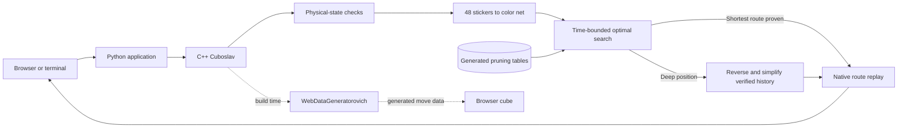

# Rubikoslav

Rubikoslav is a 3×3 Rubik's Cube solver with a native C++ cube model, an adaptive Python search engine, and an interactive browser view.

It tries to prove the shortest route first and switches to a fast route for deep positions. Every answer is replayed through the C++ model before the browser is allowed to show it.

There are no saved scrambles or position-specific answers. The fallback is calculated from the moves that made the current cube.

## Run it

Install [uv](https://docs.astral.sh/uv/getting-started/installation/), then run:

```bash
uv run rubikoslav
```

uv creates the environment, installs the locked dependencies, compiles the small C++ extension, starts the local server, and opens <http://127.0.0.1:4173>.

To start it without opening a browser:

```bash
uv run rubikoslav --no-open
```

## Use the visualizer

Imagine you want to study the position made by `R U F2`.

1. Press `R`, `U`, and `F2`. The "Your moves" row records them as you go.
2. Press "Solve & play." The app saves the cube state and asks the solver for a route.
3. The move row becomes the verified solution. Use the playback controls or select a move to revisit it.
4. Press "Reset" inside the move row to return to a solved cube and clear the list.

"Load route" accepts normal notation such as `R U R' U'`. Compact `A`–`R` engine codes also work where they do not conflict with a face letter.

The raw sticker array is handled automatically. You only need it when calling the Python API directly.

## System design



The normal solve path runs from the browser or terminal through validation, translation, search, and native replay. A separate build-time path derives the browser's sticker permutations from C++, so the visual cube and native cube share the same movement rules.

## Cube and move formats

The native solved state contains eight stickers for each face color:

| Value | Color | Face |
| ---: | --- | --- |
| `0` | White | Up |
| `1` | Red | Left |
| `2` | Blue | Front |
| `3` | Green | Back |
| `4` | Orange | Right |
| `5` | Yellow | Down |

Normal notation follows the usual rules: `R` is a quarter turn, `R2` is a half turn, and `R'` is the reverse quarter turn.

## Commands

| Command | What it does |
| --- | --- |
| `uv run rubikoslav` | Builds what is needed and opens the visualizer. |
| `uv run rubikoslav --no-open` | Starts the app without opening a browser. |
| `uv run rubikoslav --port 8080` | Uses another local port. |
| `uv run rubikoslav solve "R U R' U'"` | Solves a terminal scramble. |
| `uv run rubikoslav doctor` | Checks the native module, solver, and web files. |
| `uv run rubikoslav doctor --strict` | Solves a real state and replays the answer through C++. |

To move the generated-table cache:

```bash
export RUBIKOSLAV_CACHE_DIR=/absolute/path/to/cache
uv run rubikoslav doctor --strict
```

Deleting the cache affects first-run time, not correctness. The tables are generated again when required.

## Development

Requirements are uv, a C++20 compiler, and the platform's normal development tools.

```bash
uv sync --locked
uv run python -m unittest discover -s python/tests -v
```

Run the native suite:

```bash
cmake -S . -B build/native \
  -DRUBIKOSLAV_BUILD_PYTHON=OFF \
  -DRUBIKOSLAV_WARNINGS_AS_ERRORS=ON
cmake --build build/native --parallel
ctest --test-dir build/native --output-on-failure
```

After changing native face-turn logic, rebuild the browser movement data:

```bash
cmake --build build/native --target generate-web-data
ctest --test-dir build/native --output-on-failure
```

`WebDataGeneratorovichIsCurrent` catches drift between the C++ cube and `web/generated/cube-data.js`.

Build the source archive and platform wheel with:

```bash
uv build
```

GitHub Actions repeats the Python tests, strict solve, package build, warning-clean native build, and CTest on Linux, macOS, and Windows.

## Deployment

Pushes to `main` trigger `.github/workflows/deploy.yml`. It tests the real engine before deploying the browser and Python/C++ endpoint. The repository needs one Actions secret named `VERCEL_TOKEN`.

For a manual production deployment:

```bash
vercel --prod
```

Vercel stores generated search tables under `/tmp` for each warm function instance. A cold instance has to initialize them again.

## Troubleshooting

- First solve is slower: the optimal solver is generating or loading its local tables.
- C++ does not compile: install the platform compiler tools, then run `uv sync --reinstall-package rubikoslav`.
- Port 4173 is busy: run `uv run rubikoslav --port 4174`.
- The cube moves but static-page solving fails: `python3 -m http.server` has no solve endpoint; use `uv run rubikoslav`.

For one practical health check:

```bash
uv sync --locked
uv run rubikoslav doctor --strict
uv run python -m unittest discover -s python/tests -v
```

## License

Rubikoslav is licensed under the GNU General Public License version 3.0. See [LICENSE](LICENSE).
