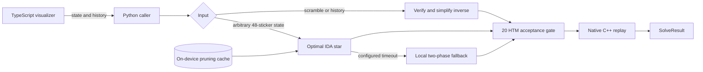

# Architecture

The Python package exposes one cube model and three bounded ways to produce a route.

## Python layer

`python/rubikoslav/solver.py` owns request validation, backend selection, the 20-move acceptance boundary, timing, and `SolveResult`. The public package exports these high-level pieces from `rubikoslav.__init__`.

### Known-history path

When a caller supplies `history`, Rubikoslav native-replays it to prove that it creates the submitted state. It reverses and simplifies the history and accepts it only when it fits the requested depth. This is the usual `solve_scramble()` path.

### Optimal path

An arbitrary state with no history is translated into the search library's representation. The Korf IDA* backend loads or generates local transition and pruning tables, then searches up to 20 HTM moves.

### Bounded fallback

When `optimal_timeout_seconds` is configured, an optimal timeout can fall back to the process-local two-phase solver. Long verified histories in the web path use the same fallback directly. Every answer remains subject to the same 20-move gate and native replay.

## Native layer

`rubikoslav::Cuboslav` owns the 48 movable stickers and the 18 standard face turns. `CuboslavWrapper` is the pybind11 bridge used by Python.

Before accepting an external state, the native model validates:

- eight stickers of each color;
- valid corner and edge identities;
- corner orientation and edge-flip invariants;
- reachable permutation parity.

After a Python backend proposes a route, the same native model applies every move and checks that the final state equals `SOLVED_STATE`.

## Browser layer

The browser is a visualization client written in strict TypeScript. It owns controls, rendering, camera movement, timeline state, and animation. It does not contain a search algorithm.

The committed modules under `web/dist/` are compiled from `web/src/` and ship in wheels and on Vercel. C++ generates the typed sticker permutations used by the renderer, so browser turns and native turns share one source of truth.

The local CLI server and Vercel handler both expose `POST /api/solve` for the visualizer. That route is an internal transport for the app; Python consumers should call the package API directly.

## Process model

Optimal tables and backend instances are process-global. Initialization is guarded, and searches are serialized with a lock. Disk cache survives process restarts when its directory is persistent; in-memory backend state does not.

No solve path sends cube data to a third-party solver service.
