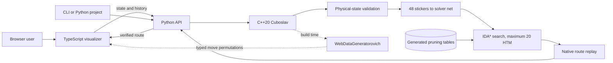

# Architecture

Rubikoslav keeps one physical cube model at the center of every interface.

## Native engine

`rubikoslav::Cuboslav` owns the 48 movable stickers and implements all 18 face turns. It checks color counts, piece identity, orientation invariants, and permutation reachability before accepting an external state.

## Python solver

`Rubikoslav` translates the native state into the color net expected by the search dependency. The solver uses increasing cost bounds and admissible pruning tables, with 20 as the hard maximum in the half-turn metric. A route is returned only after the C++ engine replays it to the solved state.

## Browser

The browser application is written in strict TypeScript under `web/src/`. `app.ts` coordinates UI state; focused modules own backend transport, cube rendering, camera interaction, move notation, DOM helpers, and the timeline. The browser-ready ES modules under `web/dist/` are compiled artifacts retained for Python wheels and Vercel.

`web/styles.css` is only an ordered entry point. Cohesive styles live under `web/styles/`: shared foundations, cube stage, application shell, API guide, move controls, dialogs, and responsive overrides. The build check validates that every module is present and imported exactly once.

TypeScript is only the visualization layer. It submits the current state and visible move history to `POST /api/solve`, validates the response shape and 20-move boundary, then animates the verified route. It does not contain or bundle a search algorithm. `WebDataGeneratorovich` derives its typed sticker permutations from the C++ engine. CTest fails if that generated TypeScript becomes stale, and npm verification fails if compiled JavaScript is stale.

Each animated face turn rotates the correct nine cubies, commits the generated permutation, and then starts the next turn.

## Hosted endpoint

The local server and Vercel function share the same payload validation and Python solving function. The visualizer always uses this endpoint. Hosted requests receive a short optimal-search budget. When a deep search times out, Python can ask C++ to verify the submitted movement history, reverse and simplify it, and accept that fallback only when it is no longer than 20 moves.
