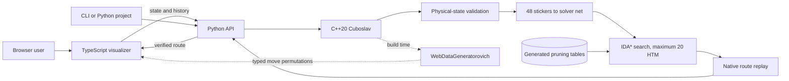

# Architecture

Every Rubikoslav interface works from the same physical cube model.

## Native engine

`rubikoslav::Cuboslav` owns the 48 movable stickers and all 18 face turns. Before accepting an external state, it checks color counts, piece identity, orientation invariants, and whether the permutation is reachable.

## Python solver

`Rubikoslav` translates the native state into the color net used by the search dependency. The solver raises its cost bound gradually and uses admissible pruning tables, with a hard limit of 20 moves in the half-turn metric. It only returns a route after the C++ engine replays it to the solved state.

## Browser

The browser app is strict TypeScript under `web/src/`. `app.ts` coordinates the interface, while focused modules handle backend calls, cube rendering, camera movement, notation, DOM helpers, and the move timeline. The browser-ready modules in `web/dist/` are compiled artifacts kept for Python wheels and Vercel.

`web/styles.css` is just the ordered entry point. The actual styles live under `web/styles/`, grouped into foundations, cube stage, app shell, API guide, move controls, dialogs, and responsive overrides. The build check makes sure every module exists and is imported exactly once.

TypeScript only handles the visualization. It sends the current state and visible move history to `POST /api/solve`, checks the response shape and 20-move limit, then animates the verified route. There is no search algorithm in the browser bundle. `WebDataGeneratorovich` derives the typed sticker permutations from the C++ engine. CTest catches stale generated TypeScript, and npm verification catches stale compiled JavaScript.

For each animated move, the browser rotates the correct nine cubies, commits the generated permutation, and only then starts the next turn.

## Hosted endpoint

The local server and Vercel function share the same payload validation and Python solve function, and the visualizer always goes through that endpoint. A verified inverse history returns immediately when it is 20 moves or fewer. Longer histories go straight to a local two-phase search with the same 20-move cap. C++ replays every returned route.
