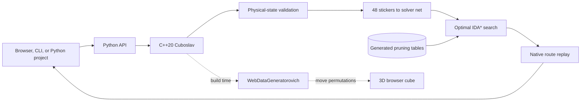

# Architecture

Rubikoslav keeps one physical cube model at the center of every interface.

## Native engine

`rubikoslav::Cuboslav` owns the 48 movable stickers and implements all 18 face turns. It checks color counts, piece identity, orientation invariants, and permutation reachability before accepting an external state.

## Python solver

`Rubikoslav` translates the native state into the color net expected by the search dependency. The solver uses increasing cost bounds and admissible pruning tables. A route is returned only after the C++ engine replays it to the solved state.

## Browser

The browser does not maintain a second handwritten set of cube rules. `WebDataGeneratorovich` derives its sticker permutations from the C++ engine during the build. CTest fails if the generated JavaScript becomes stale.

Each animated face turn rotates the correct nine cubies, commits the generated permutation, and then starts the next turn.

## Hosted endpoint

The local server and Vercel function share the same payload validation and solving function. Hosted requests receive a short optimal-search budget. When a deep search times out, the server can verify, reverse, and simplify the actual button history.
